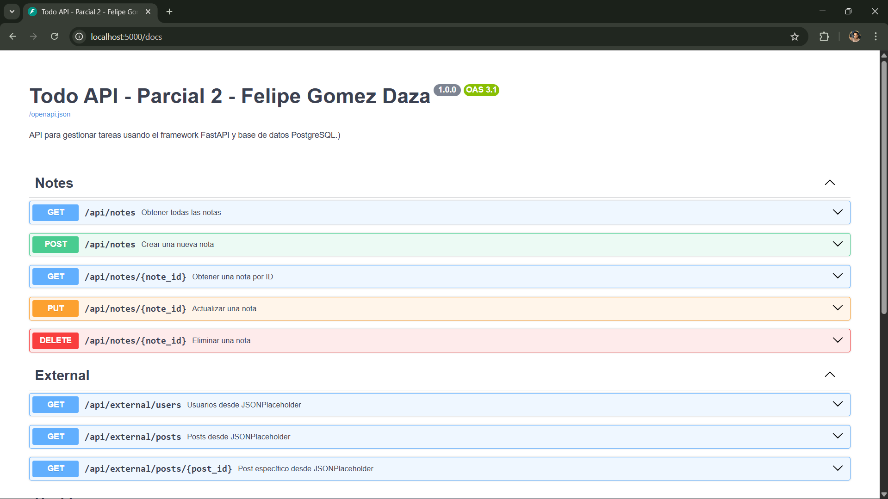

# Todo API - Parcial 2 - Felipe Gomez Daza

API RESTful para gestión de notas (To-Do List) con FastAPI y PostgreSQL.

## Vista de la API


## ¿Qué hace?
- CRUD completo de notas
- Integración con JSONPlaceholder (usuarios y posts externos)
- Validaciones automáticas con Pydantic
- Dockerizado con PostgreSQL

## Ejecución rápida
```bash
cd todo-api
cp .env.example .env
docker-compose up --build
```

Documentación completa: [todo-api/README.md](./todo-api/README.md)  
Swagger UI: http://localhost:5000/docs
